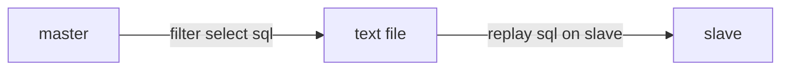

<b>Keep your slave warm</b>

note:
pt-query-digest 2.2.x had removed this function. 

# pt-query-digest --version
pt-query-digest 2.1.9

workflow:



steps:
1. capture select statement on master server, and save result into text file. 

```
pt-query-digest  --charset=utf8 --processlist h=172.33.0.3,u=book_user,p='xxxxxx',P=3306,D=dbname \
 --interval=1 --run-time=30s --filter '$event->{arg} =~ m/^select/i' --print --no-report
``` 

2. replay select sql statement on slave server. 

```
pt-query-digest master_select.log \
 --charset=utf8 --execute-throttle 70,30,5 --no-report --statistics \
 --execute h=172.33.0.8,P=3306,u=book_user,p='xxxxxx',D=dbname 
```

<b>use one statement instead:</b>
```
pt-query-digest --charset=utf8 --processlist h=172.33.0.3,u=book_user,p='xxxxxx',P=3306,D=dbname --interval=1 --run-time=30s --filter 
 '$event->{arg} =~ m/^select/i' --execute h=172.33.0.8,P=3306,D=dbname,u=book_user,p='xxxxxx' --execute-throttle 70,30,5 --no-report
```

`interval: How frequently to poll the processlist, default is .1 (means 100ms), and .01 means 10ms, .001 means 1ms.`

### Compare to percona playback
playback is usefull for warm your server, but don’t run it on the production server,because playback will run both SELECT and DML queries. read more:
   <a href="http://www.percona.com/doc/percona-playback/index.html">http://www.percona.com/doc/percona-playback/index.html</a>
   <a href="https://archive.fosdem.org/2013/schedule/event/bp_hot_slave/attachments/slides/271/export/events/attachments/bp_hot_slave/slides/271/slides.pdf">bp_hot_slave-slide</a>
